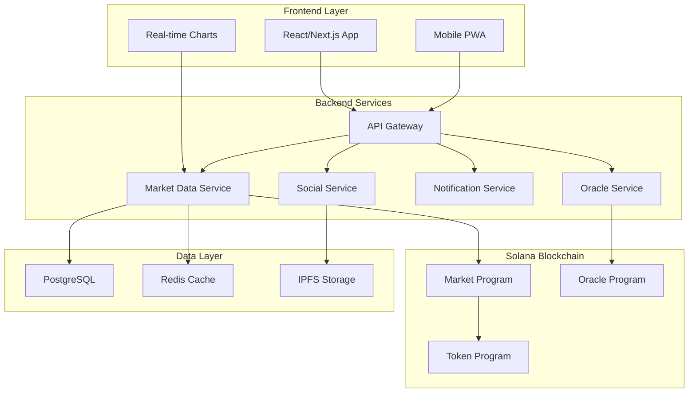

# Design Document

## Overview

PredictionPump is built as a full-stack Solana application combining on-chain smart contracts with a modern web interface. The architecture leverages Solana's high throughput for real-time trading, Anchor framework for smart contract development, and a React-based frontend with real-time data synchronization.

The system uses a microservices approach with separate services for market data, oracle integration, notifications, and social features. All critical trading logic and settlement occurs on-chain, while social features and analytics are handled off-chain for optimal performance.

## Architecture



## Components and Interfaces

### Smart Contracts (Anchor/Rust)

#### Market Program
- **MarketAccount**: Stores market metadata, bonding curve parameters, and settlement status
- **OutcomeTokenMint**: SPL token mints for each outcome (Yes/No for binary, multiple for multi-choice)
- **BondingCurve**: Implements automated market maker with configurable curve parameters
- **LiquidityPool**: Manages SOL reserves and fee distribution

```rust
#[account]
pub struct Market {
    pub creator: Pubkey,
    pub description: String,
    pub resolution_date: i64,
    pub oracle_source: Pubkey,
    pub outcome_tokens: Vec<Pubkey>,
    pub bonding_curve_params: BondingCurveParams,
    pub total_volume: u64,
    pub status: MarketStatus,
    pub settlement_data: Option<SettlementData>,
}

#[account]
pub struct BondingCurveParams {
    pub initial_price: u64,
    pub curve_steepness: u64,
    pub max_supply: u64,
    pub fee_rate: u16, // basis points
}
```

#### Trading Instructions
- `create_market`: Deploy new prediction market with bonding curve
- `buy_tokens`: Purchase outcome tokens with SOL, price calculated by curve
- `sell_tokens`: Sell outcome tokens back to curve for SOL
- `add_liquidity`: Provide SOL liquidity to earn fees
- `remove_liquidity`: Withdraw liquidity and accumulated fees
- `settle_market`: Resolve market using oracle data and distribute payouts

### Backend Services (Node.js/TypeScript)

#### Market Data Service
- Real-time price feeds using WebSocket connections
- Historical data aggregation and chart generation
- Trading volume and liquidity metrics
- Market trending algorithms based on volume, volatility, and social engagement

#### Oracle Service
- Integration with multiple oracle providers (Pyth, Switchboard, Chainlink)
- Custom oracle for social events using API aggregation
- Dispute resolution mechanism with community voting
- Automated settlement triggers based on resolution dates

#### Social Service
- User profiles with trading statistics and reputation scores
- Comment system with moderation and spam filtering
- Achievement system with NFT badge minting
- Leaderboards with various ranking criteria (profit, accuracy, volume)

#### Notification Service
- Real-time push notifications for price alerts and market events
- Email notifications for market settlements and achievements
- Social notifications for follows, comments, and mentions
- WebSocket connections for live updates

### Frontend Application (React/Next.js/TypeScript)

#### Core Components
- **MarketList**: Trending markets with filtering and sorting
- **MarketDetail**: Individual market view with trading interface
- **TradingChart**: Real-time price charts with technical indicators
- **WalletConnection**: Solana wallet integration (Phantom, Solflare, etc.)
- **UserProfile**: Personal dashboard with positions and statistics

#### State Management
- Redux Toolkit for global state management
- React Query for server state and caching
- Zustand for wallet and connection state
- Real-time updates via WebSocket subscriptions

## Data Models

### On-Chain Data Structures

```rust
#[derive(AnchorSerialize, AnchorDeserialize, Clone)]
pub struct MarketStatus {
    pub is_active: bool,
    pub is_settled: bool,
    pub winning_outcome: Option<u8>,
    pub settlement_timestamp: Option<i64>,
}

#[derive(AnchorSerialize, AnchorDeserialize, Clone)]
pub struct UserPosition {
    pub market: Pubkey,
    pub outcome_tokens: Vec<TokenBalance>,
    pub liquidity_tokens: u64,
    pub entry_price: u64,
    pub unrealized_pnl: i64,
}

#[derive(AnchorSerialize, AnchorDeserialize, Clone)]
pub struct TokenBalance {
    pub mint: Pubkey,
    pub amount: u64,
    pub outcome_index: u8,
}
```

### Off-Chain Database Schema

```sql
-- Markets table for metadata and analytics
CREATE TABLE markets (
    id UUID PRIMARY KEY,
    program_account VARCHAR(44) NOT NULL,
    creator_wallet VARCHAR(44) NOT NULL,
    title VARCHAR(255) NOT NULL,
    description TEXT,
    category VARCHAR(50),
    resolution_date TIMESTAMP,
    created_at TIMESTAMP DEFAULT NOW(),
    total_volume BIGINT DEFAULT 0,
    trader_count INTEGER DEFAULT 0,
    status VARCHAR(20) DEFAULT 'active'
);

-- User profiles and social data
CREATE TABLE users (
    wallet_address VARCHAR(44) PRIMARY KEY,
    username VARCHAR(50) UNIQUE,
    bio TEXT,
    avatar_url VARCHAR(255),
    reputation_score INTEGER DEFAULT 0,
    total_trades INTEGER DEFAULT 0,
    win_rate DECIMAL(5,2) DEFAULT 0,
    created_at TIMESTAMP DEFAULT NOW()
);

-- Social interactions
CREATE TABLE comments (
    id UUID PRIMARY KEY,
    market_id UUID REFERENCES markets(id),
    user_wallet VARCHAR(44) REFERENCES users(wallet_address),
    content TEXT NOT NULL,
    created_at TIMESTAMP DEFAULT NOW(),
    likes_count INTEGER DEFAULT 0
);
```

## Error Handling

### Smart Contract Error Handling
- Custom error codes for different failure scenarios
- Proper validation of all inputs and state transitions
- Graceful handling of oracle failures with fallback mechanisms
- Slippage protection for trades with maximum acceptable price impact

```rust
#[error_code]
pub enum MarketError {
    #[msg("Market has already been settled")]
    MarketAlreadySettled,
    #[msg("Insufficient liquidity for trade")]
    InsufficientLiquidity,
    #[msg("Oracle data not available")]
    OracleDataUnavailable,
    #[msg("Trade exceeds maximum slippage")]
    SlippageExceeded,
}
```

### Frontend Error Handling
- Comprehensive error boundaries for React components
- User-friendly error messages with actionable guidance
- Automatic retry mechanisms for failed transactions
- Offline state handling with cached data display

### Backend Error Handling
- Structured logging with correlation IDs for request tracking
- Circuit breaker pattern for external API calls
- Database transaction rollbacks for data consistency
- Rate limiting and DDoS protection

## Testing Strategy

### Smart Contract Testing
- Unit tests for all program instructions using Anchor's testing framework
- Integration tests with local Solana validator
- Fuzzing tests for bonding curve calculations
- Security audits focusing on economic attacks and edge cases

```rust
#[cfg(test)]
mod tests {
    use super::*;
    
    #[tokio::test]
    async fn test_bonding_curve_pricing() {
        // Test that buying tokens increases price correctly
        // Test that selling tokens decreases price correctly
        // Test edge cases like zero liquidity
    }
    
    #[tokio::test]
    async fn test_market_settlement() {
        // Test automatic settlement with oracle data
        // Test dispute resolution mechanism
        // Test payout distribution accuracy
    }
}
```

### Frontend Testing
- Component testing with React Testing Library
- End-to-end testing with Playwright for critical user flows
- Visual regression testing for UI consistency
- Performance testing for real-time data updates

### Backend Testing
- API endpoint testing with Jest and Supertest
- Database integration testing with test containers
- Load testing for high-frequency trading scenarios
- Oracle integration testing with mock data providers

### Security Considerations
- Smart contract security audits by reputable firms
- Frontend security scanning for XSS and injection vulnerabilities
- API security testing including authentication and authorization
- Regular dependency updates and vulnerability scanning