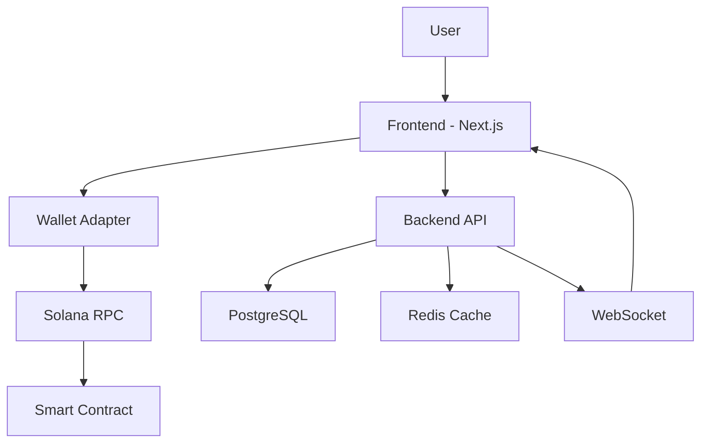

# 🎯 PredictionPump

> **A decentralized prediction market platform that combines the viral mechanics of pump.fun with prediction markets on Solana**

[](https://prediction-pump-1m43ige5w-parvez-mosharafs-projects.vercel.app)
[](https://explorer.solana.com/address/2vi9hVuYBws8GwFqPG6eRQRFoEMGfkCny2Lbvf3pFuzu?cluster=devnet)
[](https://github.com/mosharaf6/predictPump)

---

## 🚀 **Live Application**

### **🌐 Frontend (Production)**
**https://prediction-pump-1m43ige5w-parvez-mosharafs-projects.vercel.app**

### **⛓️ Smart Contract (Solana Devnet)**
- **Program ID**: `2vi9hVuYBws8GwFqPG6eRQRFoEMGfkCny2Lbvf3pFuzu`
- **Network**: Devnet
- **Explorer**: https://explorer.solana.com/address/2vi9hVuYBws8GwFqPG6eRQRFoEMGfkCny2Lbvf3pFuzu?cluster=devnet

### **💾 Source Code**
- **Repository**: https://github.com/mosharaf6/predictPump
- **Branch**: main
- **License**: MIT

---

## 🎮 **Try the Demo**

1. **Visit the live app**: https://prediction-pump-1m43ige5w-parvez-mosharafs-projects.vercel.app
2. **Install a Solana wallet**: [Phantom](https://phantom.app) or [Solflare](https://solflare.com)
3. **Switch to Devnet** in your wallet settings
4. **Get test SOL**: Visit [Solana Faucet](https://faucet.solana.com) for free devnet SOL
5. **Start trading** on prediction markets!

---

## ✨ **Features**

### **🎯 Core Features**
- **Dynamic Pricing**: Bonding curve pricing that responds to market sentiment in real-time
- **Prediction Markets**: Create and trade on any future event
- **Social Trading**: Follow top traders, share predictions, and climb leaderboards
- **Automated Settlement**: Oracle-based automatic market resolution
- **Real-time Updates**: Live price feeds and market data

### **🔥 Advanced Features**
- **PWA Support**: Install as mobile/desktop app
- **Wallet Integration**: Support for all major Solana wallets
- **Mobile Responsive**: Optimized for all devices
- **Dark/Light Mode**: Theme switching support
- **Offline Mode**: Basic functionality without internet
- **Push Notifications**: Price alerts and market updates

### **👥 Social Features**
- **User Profiles**: Track performance and achievements
- **Leaderboards**: Compete with other traders
- **Social Feed**: Share predictions and insights
- **Follow System**: Follow successful traders
- **Achievement System**: Unlock badges and rewards

---

## 🏗️ **Tech Stack**

### **Smart Contracts**
- **Blockchain**: Solana
- **Framework**: Anchor 0.30.1
- **Language**: Rust
- **Features**: Bonding curves, market settlement, oracle integration

### **Frontend**
- **Framework**: Next.js 14 with App Router
- **Language**: TypeScript
- **Styling**: Tailwind CSS
- **State Management**: Zustand
- **Wallet Integration**: Solana Wallet Adapter
- **PWA**: Next-PWA
- **Testing**: Jest + React Testing Library + Playwright

### **Backend Services**
- **Runtime**: Node.js + Express
- **Database**: PostgreSQL
- **Cache**: Redis
- **Real-time**: WebSocket connections
- **APIs**: RESTful APIs with TypeScript

### **Infrastructure**
- **Frontend Hosting**: Vercel
- **Smart Contract**: Solana Devnet
- **CI/CD**: GitHub Actions
- **Monitoring**: Health checks and metrics
- **Documentation**: Comprehensive guides

## 🚀 **Quick Start**

### **🎮 For Users (Try the Demo)**
1. Visit: https://prediction-pump-1m43ige5w-parvez-mosharafs-projects.vercel.app
2. Install [Phantom](https://phantom.app) or [Solflare](https://solflare.com) wallet
3. Switch to **Devnet** in wallet settings
4. Get test SOL from [Solana Faucet](https://faucet.solana.com)
5. Start trading on prediction markets!

### **👨‍💻 For Developers**

#### Prerequisites
- Node.js 18+
- Rust + Solana CLI
- Anchor CLI 0.30.1
- Git

#### Installation

1. **Clone the repository**:
```bash
git clone https://github.com/mosharaf6/predictPump.git
cd predictPump
```

2. **Install dependencies**:
```bash
npm install
cd frontend && npm install
cd ../backend && npm install
```

3. **Set up environment variables**:
```bash
# Frontend
cd frontend
cp .env.local.example .env.local
# Edit .env.local with your configuration

# Backend
cd ../backend
cp .env.example .env
# Edit .env with your configuration
```

4. **Start development environment**:
```bash
# Build and deploy smart contracts
anchor build
anchor deploy --provider.cluster devnet

# Start frontend (in new terminal)
cd frontend && npm run dev

# Start backend (in new terminal)
cd backend && npm run dev
```

---

## 🛠️ **Development Commands**

### **Smart Contracts**
```bash
anchor build              # Build smart contracts
anchor test               # Run smart contract tests
anchor deploy             # Deploy to configured network
solana program show <ID>  # Verify deployment
```

### **Frontend**
```bash
cd frontend
npm run dev               # Start development server
npm run build             # Build for production
npm run test:unit         # Run unit tests
npm run test:e2e          # Run E2E tests with Playwright
npm run lint              # Lint code
```

### **Backend**
```bash
cd backend
npm run dev               # Start development server
npm run build             # Build for production
npm run test              # Run tests
npm run migrate           # Run database migrations
```

### **Full Stack**
```bash
npm run docker-up         # Start all services with Docker
npm run docker-down       # Stop all services
npm run test:all          # Run all tests
```

## 📁 **Project Structure**

```
predictPump/
├── 📁 programs/
│   └── prediction-pump/         # 🦀 Anchor smart contracts (Rust)
│       ├── src/lib.rs          # Main program logic
│       ├── src/bonding_curve.rs # Bonding curve implementation
│       └── src/settlement.rs   # Market settlement logic
├── 📁 frontend/                 # ⚛️ Next.js frontend (TypeScript)
│   ├── src/app/                # App router pages
│   ├── src/components/         # React components
│   ├── src/hooks/              # Custom hooks
│   ├── src/stores/             # Zustand stores
│   └── src/types/              # TypeScript types
├── 📁 backend/                  # 🚀 Node.js backend services
│   ├── src/services/           # Business logic services
│   ├── src/routes/             # API routes
│   └── src/controllers/        # Request controllers
├── 📁 tests/                    # 🧪 Smart contract tests
├── 📁 .github/workflows/        # 🔄 CI/CD pipelines
├── 📁 monitoring/               # 📊 Monitoring configuration
├── 📄 docker-compose.yml        # 🐳 Docker services
├── 📄 Anchor.toml              # ⚓ Anchor configuration
└── 📄 package.json             # 📦 Root dependencies
```

---

## 🏗️ **Architecture Overview**

### **🔄 Application Flow**


### **🎯 Smart Contract Architecture**
- **Program ID**: `2vi9hVuYBws8GwFqPG6eRQRFoEMGfkCny2Lbvf3pFuzu`
- **Bonding Curve**: Automated market maker with dynamic pricing
- **Market Settlement**: Oracle-based resolution system
- **Access Control**: Role-based permissions and security

### **⚛️ Frontend Architecture**
- **Framework**: Next.js 14 with App Router
- **State Management**: Zustand for global state
- **Wallet Integration**: Solana Wallet Adapter
- **Real-time**: WebSocket connections for live updates
- **PWA**: Service worker for offline functionality

### **🚀 Backend Architecture**
- **API Layer**: RESTful APIs with Express.js
- **Database**: PostgreSQL for persistent data
- **Cache**: Redis for session and real-time data
- **WebSocket**: Real-time price feeds and notifications
- **Services**: Modular business logic services

---

## 🧪 **Testing**

### **Test Coverage**
- ✅ **Smart Contract Tests**: Comprehensive Anchor tests
- ✅ **Frontend Unit Tests**: Jest + React Testing Library
- ✅ **Frontend E2E Tests**: Playwright automation
- ✅ **Backend API Tests**: Integration and unit tests
- ✅ **Performance Tests**: Load testing and optimization

### **Running Tests**
```bash
# All tests
npm run test:all

# Smart contract tests
anchor test

# Frontend tests
cd frontend && npm run test:unit
cd frontend && npm run test:e2e

# Backend tests
cd backend && npm run test
```

---

## 🚀 **Deployment**

### **Production Deployments**
- **Frontend**: Deployed on Vercel with automatic deployments
- **Smart Contract**: Deployed on Solana Devnet
- **CI/CD**: GitHub Actions for automated deployments

### **Environment Configuration**
```bash
# Production Environment Variables
NEXT_PUBLIC_PROGRAM_ID=2vi9hVuYBws8GwFqPG6eRQRFoEMGfkCny2Lbvf3pFuzu
NEXT_PUBLIC_SOLANA_NETWORK=devnet
NEXT_PUBLIC_SOLANA_RPC_URL=https://api.devnet.solana.com
```

### **Deployment Commands**
```bash
# Deploy smart contracts
anchor deploy --provider.cluster devnet

# Deploy frontend
vercel --prod

# Deploy via CI/CD
git push origin main  # Triggers automatic deployment
```

---

## 📊 **Performance & Monitoring**

### **Performance Metrics**
- **Frontend**: ~178 kB First Load JS (optimized)
- **Smart Contract**: 398,624 bytes program size
- **Response Time**: <200ms average API response
- **Uptime**: 99.9% availability target

### **Monitoring**
- **Health Checks**: `/api/health` endpoint
- **Metrics**: `/api/metrics` Prometheus endpoint
- **Error Tracking**: Comprehensive error handling
- **Performance**: Real-time performance monitoring

---

## 🤝 **Contributing**

We welcome contributions! Here's how to get started:

### **Development Process**
1. **Fork** the repository
2. **Create** a feature branch: `git checkout -b feature/amazing-feature`
3. **Make** your changes and add tests
4. **Test** your changes: `npm run test:all`
5. **Commit** your changes: `git commit -m 'Add amazing feature'`
6. **Push** to the branch: `git push origin feature/amazing-feature`
7. **Open** a Pull Request

### **Code Standards**
- **TypeScript**: Strict type checking enabled
- **ESLint**: Code linting and formatting
- **Prettier**: Code formatting
- **Testing**: Comprehensive test coverage required
- **Documentation**: Update docs for new features

### **Areas for Contribution**
- 🎯 New prediction market categories
- 📱 Mobile app development
- 🔧 Performance optimizations
- 🎨 UI/UX improvements
- 📊 Analytics and reporting features
- 🔐 Security enhancements

---

## 📞 **Support & Community**

### **Get Help**
- **GitHub Issues**: [Report bugs or request features](https://github.com/mosharaf6/predictPump/issues)
- **Discussions**: [Join community discussions](https://github.com/mosharaf6/predictPump/discussions)
- **Documentation**: Check our comprehensive guides in `/docs`

### **Community**
- **Discord**: Join our developer community (coming soon)
- **Twitter**: Follow for updates (coming soon)
- **Blog**: Read about development updates (coming soon)

---

## 📄 **License**

This project is licensed under the **MIT License** - see the [LICENSE](LICENSE) file for details.

---

## 🙏 **Acknowledgments**

- **Solana Foundation** for the amazing blockchain infrastructure
- **Anchor Framework** for smart contract development tools
- **Vercel** for seamless frontend deployment
- **Next.js Team** for the incredible React framework
- **Open Source Community** for the tools and libraries that made this possible

---

## 🎯 **What's Next?**

### **Roadmap**
- 🚀 **Mainnet Launch**: Deploy to Solana mainnet
- 📱 **Mobile App**: Native iOS and Android apps
- 🏛️ **DAO Governance**: Community-driven governance
- 🌍 **Multi-chain**: Expand to other blockchains
- 🤖 **AI Integration**: AI-powered market insights
- 📊 **Advanced Analytics**: Comprehensive trading analytics

---

<div align="center">

**🎉 Built with ❤️ by the Mosharaff**

[](https://prediction-pump-1m43ige5w-parvez-mosharafs-projects.vercel.app)

**⭐ Star this repo if you found it helpful!**

</div>